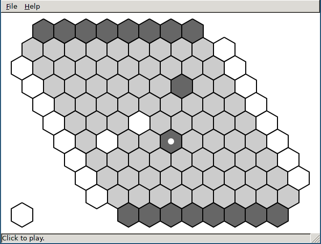
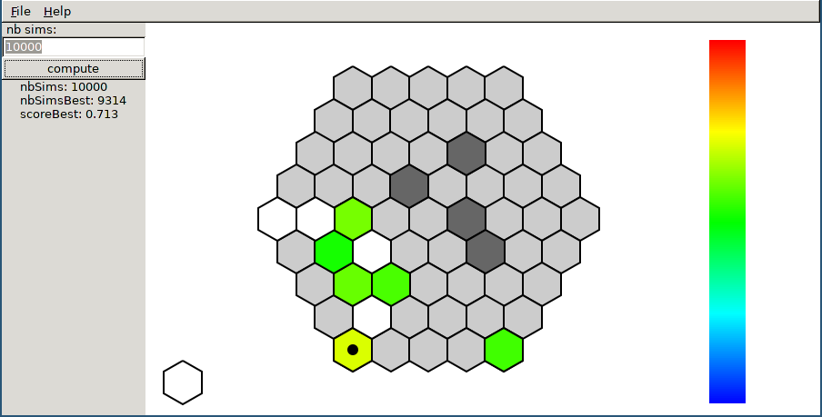

# hex_hav

The Hex and Havannah connection games with MCTS-based AI players.


## Games 

- [Hex](https://en.wikipedia.org/wiki/Hex_(board_game))
- [Havannah](https://en.wikipedia.org/wiki/Havannah)


## MCTS-based algorithms (AI players)

- `PlayerMcts`: vanilla [MCTS/UCT](https://pdfs.semanticscholar.org/a441/488e8fe40370b7f5f99eb5a1659d93fb7091.pdf)
- `PlayerRave`: MCTS with the [RAVE](http://machinelearning.wustl.edu/mlpapers/paper_files/icml2007_GellyS07.pdf) improvement
- `PlayerRaveLgrf1`: MCTS with the [last good reply](http://ieeexplore.ieee.org/stamp/stamp.jsp?arnumber=5672398) improvement
- `PlayerRaveMast`: MCTS with the [Move-Average Sampling Technique](www.aaai.org/Papers/AAAI/2008/AAAI08-041.pdf) improvement
- `PlayerRaveNast2`: MCTS with the [N-gram Average Sampling Technique](http://ieeexplore.ieee.org/document/6203383/) improvement
- `PlayerRavePpr`: MCTS with the [Playout Pruning with Rave](https://hal.archives-ouvertes.fr/hal-01342347/document) improvement
- `PlayerRavePr`: RAVE with the [poolRave](https://hal.inria.fr/inria-00485555/file/poolrave.pdf) improvement


## Build 

- cmake >= 3.0
- C++14 compiler
- pkg-config
- gtkmm 2
- cxxtest (optional)

```
mkdir build
cd build
cmake -DCMAKE_BUILD_TYPE=RELEASE ..
make -j8
```


## Run 

### Command line interface

For comparing two AI players.

- `hex_cli.out`
- `hav_cli.out`

```
$ ./hav_cli.out 7 10 Mcts 0.25_1000 Rave 70_0.25_1000

new game
black played in 0.146 s (cell 5)
white played in 0.091 s (cell 20)
...

nb games; board type; board size; white; KUCT; nbSimulations; black; KRAVE; KUCT; nbSimulations; white ratio; black ratio; mean nb turns; average time;draw; white ring; white bridge; white fork; black ring; black bridge; black fork;
10; BoardHavannah; 7; Mcts; 0.25; 1000; Rave; 70; 0.25; 1000; 0.5; 0.5; 16.3; 1.0816; 0; 0.1; 0.1; 0.3; 0.1; 0.1; 0.3; 
```

### Graphical user interface (1)

Two players (AI or human).

- `hex_gui1.out`
- `hav_gui1.out`




### Graphical user interface (2)

Two human players with AI indications (colors).

- `hex_gui2.out`
- `hav_gui2.out`




## TODO

- check unit tests
- complete this readme (references)
- write a documentation 


## Contributors

- Fabien Teytaud
- Julien Dehos
- Joris Duguépéroux
- Ahmad Mazyad


## License

See [LICENSE.txt](LICENSE.txt) (BSD-3)


